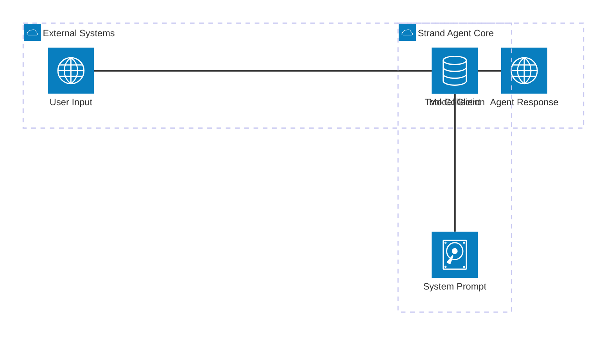
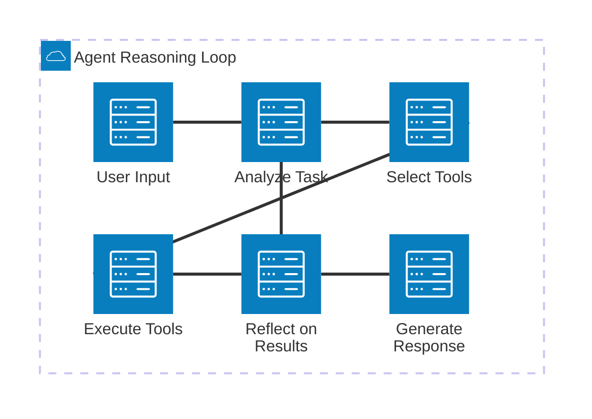
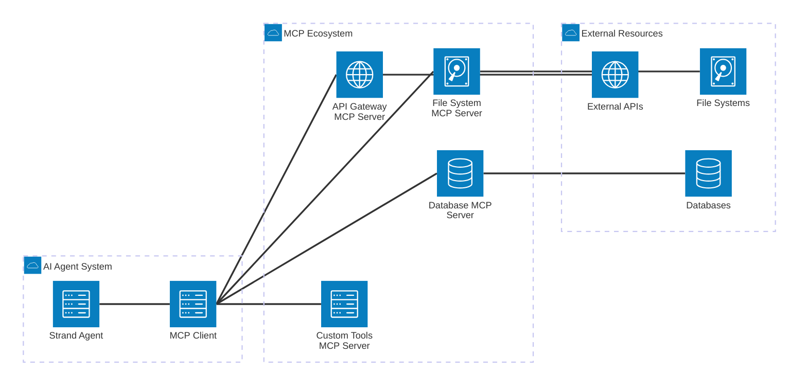
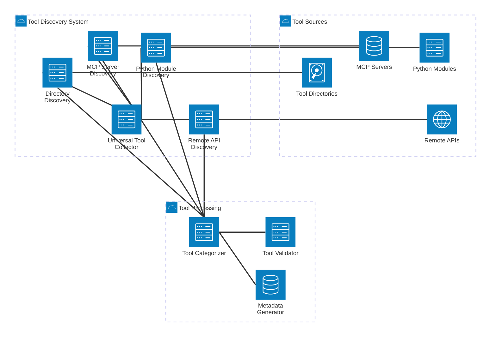
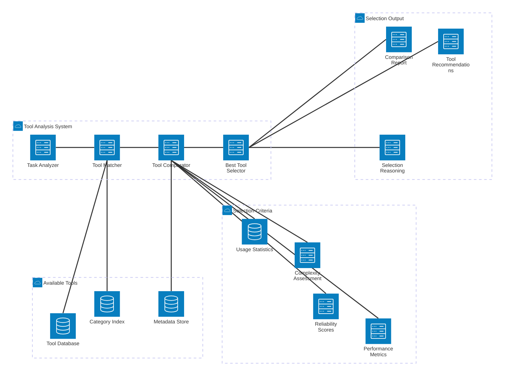
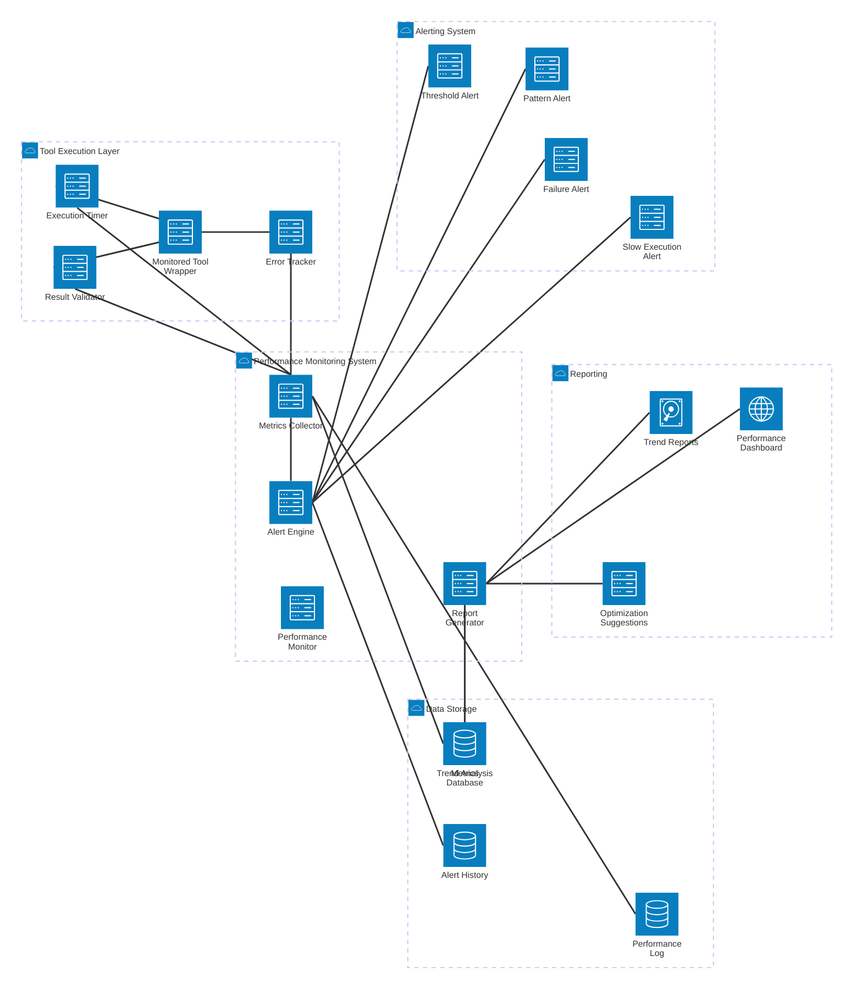

# 🧬 Generic Strand Agent Implementation Guide

## Overview

This guide explains how to build flexible, generic Strand agents that can dynamically collect, load, and compare tools from various sources including Model Context Protocol (MCP) servers. You'll learn the fundamental patterns for creating adaptable AI agents that can work with any combination of tools.

## Table of Contents

1. [Understanding Strand Agents](#understanding-strand-agents)
2. [Model Context Protocol (MCP) Fundamentals](#model-context-protocol-mcp-fundamentals)
3. [Generic Tool Collection Architecture](#generic-tool-collection-architecture)
4. [Building a Universal Tool Collector](#building-a-universal-tool-collector)
5. [Tool Comparison and Selection System](#tool-comparison-and-selection-system)
6. [Implementation Examples](#implementation-examples)
7. [Advanced Patterns](#advanced-patterns)
8. [Best Practices](#best-practices)

---

## Understanding Strand Agents

### Core Concepts

Strand agents are built on three fundamental components that work together like the two strands of DNA:



```python
# Basic Strand Agent Structure
class GenericStrandAgent:
    def __init__(self, model_client, tools=None, system_prompt=None):
        self.model = model_client      # The reasoning engine
        self.tools = tools or []       # Available capabilities
        self.system_prompt = system_prompt  # Agent behavior definition
        
    def run(self, user_input: str) -> str:
        # The agent loop: reason -> act -> respond
        return self._agent_loop(user_input)
```

### The Agent Loop

Strand agents operate in a continuous loop where the model:

1. **Reasons** about the task and available tools
2. **Selects** appropriate tools to use
3. **Executes** tool calls with proper parameters
4. **Reflects** on results and continues or responds



```python
def _agent_loop(self, user_input: str) -> str:
    """The core reasoning and action loop"""
    
    conversation = [
        {"role": "system", "content": self.system_prompt},
        {"role": "user", "content": user_input}
    ]
    
    max_iterations = 10
    iteration = 0
    
    while iteration < max_iterations:
        # Model reasons about next step
        response = self.model.generate(
            messages=conversation,
            tools=self._get_tool_schemas(),
            tool_choice="auto"
        )
        
        # Check if model wants to use tools
        if response.tool_calls:
            # Execute tool calls
            tool_results = self._execute_tool_calls(response.tool_calls)
            
            # Add results to conversation
            conversation.append({
                "role": "assistant", 
                "content": response.content,
                "tool_calls": response.tool_calls
            })
            conversation.append({
                "role": "tool",
                "content": tool_results
            })
            
            iteration += 1
        else:
            # Model is done, return final response
            return response.content
    
    return "Maximum iterations reached"
```

### Tool Interface Standard

All tools in Strand agents follow a consistent interface:

```python
from typing import Any, Dict, List, Optional
from dataclasses import dataclass

@dataclass
class ToolParameter:
    name: str
    type: str
    description: str
    required: bool = True
    default: Any = None

@dataclass
class ToolSchema:
    name: str
    description: str
    parameters: List[ToolParameter]
    
class GenericTool:
    """Base class for all Strand agent tools"""
    
    def __init__(self, name: str, description: str):
        self.name = name
        self.description = description
        self.parameters = []
    
    def get_schema(self) -> ToolSchema:
        """Return tool schema for model consumption"""
        return ToolSchema(
            name=self.name,
            description=self.description,
            parameters=self.parameters
        )
    
    async def execute(self, **kwargs) -> Dict[str, Any]:
        """Execute the tool with given parameters"""
        raise NotImplementedError("Subclasses must implement execute method")

# Example tool implementation
class FileReaderTool(GenericTool):
    def __init__(self):
        super().__init__(
            name="read_file",
            description="Read contents of a file"
        )
        self.parameters = [
            ToolParameter("file_path", "string", "Path to file to read"),
            ToolParameter("encoding", "string", "File encoding", False, "utf-8")
        ]
    
    async def execute(self, file_path: str, encoding: str = "utf-8") -> Dict[str, Any]:
        try:
            with open(file_path, 'r', encoding=encoding) as f:
                content = f.read()
            return {
                "success": True,
                "content": content,
                "file_path": file_path
            }
        except Exception as e:
            return {
                "success": False,
                "error": str(e),
                "file_path": file_path
            }
```

---

## Model Context Protocol (MCP) Fundamentals

### What is MCP?

Model Context Protocol is a standardized way for AI applications to connect with external data sources and tools. It acts as a universal adapter that allows models to:

- **Access databases** and knowledge bases
- **Use external APIs** and services
- **Interact with files** and file systems
- **Connect to custom tools** and applications

### MCP Architecture



### MCP Server Structure

MCP servers expose three main types of capabilities:

```python
class MCPServer:
    """Generic MCP Server interface"""
    
    def list_resources(self) -> List[Resource]:
        """List available resources (files, databases, etc.)"""
        pass
    
    def list_tools(self) -> List[Tool]:
        """List available tools/functions"""
        pass
    
    def list_prompts(self) -> List[Prompt]:
        """List available prompt templates"""
        pass
    
    def read_resource(self, uri: str) -> ResourceContent:
        """Read a specific resource"""
        pass
    
    def call_tool(self, name: str, arguments: Dict) -> ToolResult:
        """Execute a tool with given arguments"""
        pass
```

### MCP Client Integration

```python
import asyncio
from mcp import ClientSession, StdioServerParameters
from mcp.client.stdio import stdio_client

class MCPToolCollector:
    """Collects tools from MCP servers"""
    
    def __init__(self):
        self.servers = {}
        self.available_tools = {}
    
    async def connect_to_server(self, name: str, command: List[str]):
        """Connect to an MCP server"""
        
        server_params = StdioServerParameters(
            command=command,
            env=None
        )
        
        async with stdio_client(server_params) as (read, write):
            async with ClientSession(read, write) as session:
                # Initialize the session
                await session.initialize()
                
                # Get available tools
                tools = await session.list_tools()
                
                # Store tools with server reference
                self.servers[name] = session
                self.available_tools[name] = tools
                
                return tools
    
    async def get_all_tools(self) -> Dict[str, List]:
        """Get all tools from all connected servers"""
        all_tools = {}
        
        for server_name, tools in self.available_tools.items():
            all_tools[server_name] = []
            
            for tool in tools:
                tool_wrapper = MCPToolWrapper(
                    mcp_tool=tool,
                    server_session=self.servers[server_name],
                    server_name=server_name
                )
                all_tools[server_name].append(tool_wrapper)
        
        return all_tools

class MCPToolWrapper(GenericTool):
    """Wraps MCP tools to work with Strand agents"""
    
    def __init__(self, mcp_tool, server_session, server_name):
        super().__init__(
            name=f"{server_name}_{mcp_tool.name}",
            description=mcp_tool.description
        )
        self.mcp_tool = mcp_tool
        self.server_session = server_session
        self.server_name = server_name
        
        # Convert MCP parameters to our format
        self.parameters = [
            ToolParameter(
                name=param.name,
                type=param.type,
                description=param.description,
                required=param.required
            )
            for param in mcp_tool.inputSchema.get("properties", {}).items()
        ]
    
    async def execute(self, **kwargs) -> Dict[str, Any]:
        """Execute the MCP tool through the server session"""
        
        try:
            result = await self.server_session.call_tool(
                self.mcp_tool.name,
                kwargs
            )
            
            return {
                "success": True,
                "result": result.content,
                "server": self.server_name,
                "tool": self.mcp_tool.name
            }
        except Exception as e:
            return {
                "success": False,
                "error": str(e),
                "server": self.server_name,
                "tool": self.mcp_tool.name
            }
```

---

## Generic Tool Collection Architecture

### Tool Discovery System



```python
from pathlib import Path
import importlib
import inspect
from typing import Type, List, Dict, Any

class GenericToolCollector:
    """Discovers and collects tools from multiple sources"""
    
    def __init__(self):
        self.tools = {}
        self.tool_sources = []
        self.mcp_collector = MCPToolCollector()
    
    def add_tool_source(self, source_type: str, config: Dict[str, Any]):
        """Add a new source for tool discovery"""
        
        source = {
            "type": source_type,
            "config": config,
            "tools": []
        }
        
        self.tool_sources.append(source)
    
    async def discover_all_tools(self) -> Dict[str, List[GenericTool]]:
        """Discover tools from all configured sources"""
        
        discovered_tools = {}
        
        for source in self.tool_sources:
            if source["type"] == "python_module":
                tools = await self._discover_python_tools(source["config"])
                discovered_tools[f"python_{source['config']['module']}"] = tools
                
            elif source["type"] == "mcp_server":
                tools = await self._discover_mcp_tools(source["config"])
                discovered_tools[f"mcp_{source['config']['name']}"] = tools
                
            elif source["type"] == "directory":
                tools = await self._discover_directory_tools(source["config"])
                discovered_tools[f"dir_{source['config']['name']}"] = tools
        
        self.tools = discovered_tools
        return discovered_tools
    
    async def _discover_python_tools(self, config: Dict) -> List[GenericTool]:
        """Discover tools from Python modules"""
        
        tools = []
        module_name = config["module"]
        
        try:
            module = importlib.import_module(module_name)
            
            # Find all classes that inherit from GenericTool
            for name, obj in inspect.getmembers(module):
                if (inspect.isclass(obj) and 
                    issubclass(obj, GenericTool) and 
                    obj != GenericTool):
                    
                    tool_instance = obj()
                    tools.append(tool_instance)
        
        except ImportError as e:
            print(f"Failed to import module {module_name}: {e}")
        
        return tools
    
    async def _discover_mcp_tools(self, config: Dict) -> List[GenericTool]:
        """Discover tools from MCP servers"""
        
        server_name = config["name"]
        command = config["command"]
        
        try:
            mcp_tools = await self.mcp_collector.connect_to_server(
                server_name, command
            )
            
            # Convert MCP tools to our generic format
            tools = []
            for mcp_tool in mcp_tools:
                wrapper = MCPToolWrapper(
                    mcp_tool=mcp_tool,
                    server_session=self.mcp_collector.servers[server_name],
                    server_name=server_name
                )
                tools.append(wrapper)
            
            return tools
            
        except Exception as e:
            print(f"Failed to connect to MCP server {server_name}: {e}")
            return []
    
    async def _discover_directory_tools(self, config: Dict) -> List[GenericTool]:
        """Discover tools from directory of Python files"""
        
        tools = []
        directory = Path(config["path"])
        
        if not directory.exists():
            print(f"Directory {directory} does not exist")
            return tools
        
        # Find all Python files in directory
        for py_file in directory.glob("*.py"):
            if py_file.name.startswith("__"):
                continue
            
            try:
                # Dynamically import the module
                spec = importlib.util.spec_from_file_location(
                    py_file.stem, py_file
                )
                module = importlib.util.module_from_spec(spec)
                spec.loader.exec_module(module)
                
                # Find tool classes
                for name, obj in inspect.getmembers(module):
                    if (inspect.isclass(obj) and 
                        issubclass(obj, GenericTool) and 
                        obj != GenericTool):
                        
                        tool_instance = obj()
                        tools.append(tool_instance)
            
            except Exception as e:
                print(f"Failed to load tools from {py_file}: {e}")
        
        return tools
```

### Configuration-Driven Tool Loading

```python
# tools_config.yaml
tool_sources:
  - type: "python_module"
    config:
      module: "myproject.tools.file_tools"
      
  - type: "python_module"
    config:
      module: "myproject.tools.database_tools"
      
  - type: "mcp_server"
    config:
      name: "filesystem"
      command: ["npx", "@modelcontextprotocol/server-filesystem", "/path/to/files"]
      
  - type: "mcp_server"
    config:
      name: "github"
      command: ["npx", "@modelcontextprotocol/server-github"]
      env:
        GITHUB_PERSONAL_ACCESS_TOKEN: "${GITHUB_TOKEN}"
        
  - type: "directory"
    config:
      name: "custom_tools"
      path: "/path/to/custom/tools"

# Configuration loader
import yaml

class ToolConfigLoader:
    @staticmethod
    def load_config(config_path: str) -> Dict:
        with open(config_path, 'r') as f:
            return yaml.safe_load(f)
    
    @staticmethod
    async def setup_collector_from_config(config_path: str) -> GenericToolCollector:
        config = ToolConfigLoader.load_config(config_path)
        collector = GenericToolCollector()
        
        for source_config in config.get("tool_sources", []):
            collector.add_tool_source(
                source_config["type"],
                source_config["config"]
            )
        
        await collector.discover_all_tools()
        return collector
```

---

## Building a Universal Tool Collector

### Complete Tool Collection System

```python
import asyncio
from dataclasses import dataclass
from typing import Dict, List, Any, Optional, Callable

@dataclass
class ToolMetadata:
    """Metadata about a tool for comparison and selection"""
    
    name: str
    description: str
    source: str
    category: str
    complexity: int  # 1-10 scale
    reliability: float  # 0-1 score
    performance_score: float  # 0-1 score
    last_used: Optional[datetime] = None
    success_rate: float = 1.0
    average_execution_time: float = 0.0

class UniversalToolCollector:
    """Advanced tool collector with comparison and selection capabilities"""
    
    def __init__(self):
        self.collectors = {
            "python": PythonToolCollector(),
            "mcp": MCPToolCollector(),
            "directory": DirectoryToolCollector(),
            "remote": RemoteToolCollector()
        }
        
        self.tools_by_category = {}
        self.tool_metadata = {}
        self.tool_usage_stats = {}
    
    async def collect_all_tools(self, config: Dict) -> Dict[str, List[GenericTool]]:
        """Collect tools from all configured sources"""
        
        all_tools = {}
        
        for collector_name, collector in self.collectors.items():
            if collector_name in config:
                try:
                    tools = await collector.collect_tools(config[collector_name])
                    all_tools[collector_name] = tools
                    
                    # Categorize tools
                    await self._categorize_tools(tools, collector_name)
                    
                except Exception as e:
                    print(f"Failed to collect from {collector_name}: {e}")
                    all_tools[collector_name] = []
        
        return all_tools
    
    async def _categorize_tools(self, tools: List[GenericTool], source: str):
        """Automatically categorize tools based on their functionality"""
        
        for tool in tools:
            category = await self._infer_tool_category(tool)
            
            if category not in self.tools_by_category:
                self.tools_by_category[category] = []
            
            self.tools_by_category[category].append(tool)
            
            # Create metadata
            metadata = ToolMetadata(
                name=tool.name,
                description=tool.description,
                source=source,
                category=category,
                complexity=await self._assess_tool_complexity(tool),
                reliability=1.0,  # Start with perfect score
                performance_score=1.0
            )
            
            self.tool_metadata[tool.name] = metadata
    
    async def _infer_tool_category(self, tool: GenericTool) -> str:
        """Infer tool category from name and description"""
        
        name_lower = tool.name.lower()
        desc_lower = tool.description.lower()
        
        # File operations
        if any(word in name_lower or word in desc_lower 
               for word in ["file", "read", "write", "directory", "folder"]):
            return "file_operations"
        
        # Database operations
        elif any(word in name_lower or word in desc_lower 
                 for word in ["database", "sql", "query", "table", "db"]):
            return "database"
        
        # Web/API operations
        elif any(word in name_lower or word in desc_lower 
                 for word in ["http", "api", "web", "request", "url"]):
            return "web_api"
        
        # Text processing
        elif any(word in name_lower or word in desc_lower 
                 for word in ["text", "string", "parse", "format", "analyze"]):
            return "text_processing"
        
        # System operations
        elif any(word in name_lower or word in desc_lower 
                 for word in ["system", "process", "command", "shell", "exec"]):
            return "system"
        
        # Code analysis
        elif any(word in name_lower or word in desc_lower 
                 for word in ["code", "ast", "syntax", "compile", "lint"]):
            return "code_analysis"
        
        else:
            return "general"
    
    async def _assess_tool_complexity(self, tool: GenericTool) -> int:
        """Assess tool complexity on a 1-10 scale"""
        
        complexity = 1
        
        # More parameters = higher complexity
        complexity += min(len(tool.parameters), 3)
        
        # Required parameters increase complexity
        required_params = sum(1 for p in tool.parameters if p.required)
        complexity += min(required_params, 2)
        
        # Complex parameter types increase complexity
        complex_types = ["object", "array", "function"]
        for param in tool.parameters:
            if param.type in complex_types:
                complexity += 1
        
        return min(complexity, 10)
    
    def get_tools_by_category(self, category: str) -> List[GenericTool]:
        """Get all tools in a specific category"""
        return self.tools_by_category.get(category, [])
    
    def find_similar_tools(self, tool_name: str) -> List[GenericTool]:
        """Find tools with similar functionality"""
        
        if tool_name not in self.tool_metadata:
            return []
        
        target_metadata = self.tool_metadata[tool_name]
        category_tools = self.get_tools_by_category(target_metadata.category)
        
        # Return other tools in same category
        return [tool for tool in category_tools if tool.name != tool_name]
    
    async def update_tool_performance(self, tool_name: str, 
                                    execution_time: float, 
                                    success: bool):
        """Update tool performance metrics based on usage"""
        
        if tool_name not in self.tool_usage_stats:
            self.tool_usage_stats[tool_name] = {
                "total_calls": 0,
                "successful_calls": 0,
                "total_time": 0.0
            }
        
        stats = self.tool_usage_stats[tool_name]
        stats["total_calls"] += 1
        stats["total_time"] += execution_time
        
        if success:
            stats["successful_calls"] += 1
        
        # Update metadata
        if tool_name in self.tool_metadata:
            metadata = self.tool_metadata[tool_name]
            metadata.success_rate = stats["successful_calls"] / stats["total_calls"]
            metadata.average_execution_time = stats["total_time"] / stats["total_calls"]
            metadata.last_used = datetime.utcnow()
            
            # Update performance score (combination of success rate and speed)
            speed_score = max(0, 1 - (metadata.average_execution_time / 10))  # 10s = 0 score
            metadata.performance_score = (metadata.success_rate + speed_score) / 2
```

---

## Tool Comparison and Selection System

### Intelligent Tool Selector



```python
from enum import Enum
from typing import Union

class SelectionCriteria(Enum):
    FASTEST = "fastest"
    MOST_RELIABLE = "most_reliable"
    BEST_PERFORMANCE = "best_performance"
    LEAST_COMPLEX = "least_complex"
    MOST_RECENT = "most_recent"

class ToolSelector:
    """Intelligent tool selection and comparison system"""
    
    def __init__(self, tool_collector: UniversalToolCollector):
        self.collector = tool_collector
    
    def compare_tools(self, tool_names: List[str]) -> Dict[str, Any]:
        """Compare multiple tools across different metrics"""
        
        if not tool_names:
            return {"error": "No tools provided for comparison"}
        
        comparison_data = {
            "tools": {},
            "summary": {},
            "recommendations": {}
        }
        
        for tool_name in tool_names:
            if tool_name in self.collector.tool_metadata:
                metadata = self.collector.tool_metadata[tool_name]
                
                comparison_data["tools"][tool_name] = {
                    "description": metadata.description,
                    "source": metadata.source,
                    "category": metadata.category,
                    "complexity": metadata.complexity,
                    "reliability": metadata.reliability,
                    "performance_score": metadata.performance_score,
                    "success_rate": metadata.success_rate,
                    "avg_execution_time": metadata.average_execution_time,
                    "last_used": metadata.last_used.isoformat() if metadata.last_used else None
                }
        
        # Generate summary statistics
        comparison_data["summary"] = self._generate_comparison_summary(
            [self.collector.tool_metadata[name] for name in tool_names 
             if name in self.collector.tool_metadata]
        )
        
        # Generate recommendations
        comparison_data["recommendations"] = self._generate_tool_recommendations(tool_names)
        
        return comparison_data
    
    def select_best_tool(self, 
                        candidate_tools: List[str], 
                        criteria: SelectionCriteria = SelectionCriteria.BEST_PERFORMANCE,
                        context: Optional[Dict] = None) -> Optional[str]:
        """Select the best tool based on specified criteria"""
        
        if not candidate_tools:
            return None
        
        # Filter to tools that exist
        valid_tools = [name for name in candidate_tools 
                      if name in self.collector.tool_metadata]
        
        if not valid_tools:
            return None
        
        if criteria == SelectionCriteria.FASTEST:
            return min(valid_tools, 
                      key=lambda x: self.collector.tool_metadata[x].average_execution_time)
        
        elif criteria == SelectionCriteria.MOST_RELIABLE:
            return max(valid_tools,
                      key=lambda x: self.collector.tool_metadata[x].success_rate)
        
        elif criteria == SelectionCriteria.BEST_PERFORMANCE:
            return max(valid_tools,
                      key=lambda x: self.collector.tool_metadata[x].performance_score)
        
        elif criteria == SelectionCriteria.LEAST_COMPLEX:
            return min(valid_tools,
                      key=lambda x: self.collector.tool_metadata[x].complexity)
        
        elif criteria == SelectionCriteria.MOST_RECENT:
            recent_tools = [name for name in valid_tools 
                          if self.collector.tool_metadata[name].last_used]
            if recent_tools:
                return max(recent_tools,
                          key=lambda x: self.collector.tool_metadata[x].last_used)
            else:
                return valid_tools[0]  # If none used recently, return first
        
        return valid_tools[0]  # Default fallback
    
    def recommend_tools_for_task(self, task_description: str) -> List[Dict[str, Any]]:
        """Recommend tools based on task description"""
        
        recommendations = []
        
        # Simple keyword matching for demonstration
        # In practice, you'd use more sophisticated NLP or embeddings
        task_lower = task_description.lower()
        
        # Analyze task requirements
        for category, tools in self.collector.tools_by_category.items():
            category_relevance = self._calculate_category_relevance(task_lower, category)
            
            if category_relevance > 0.3:  # Threshold for relevance
                # Get best tools in this category
                best_tools = sorted(tools, 
                                  key=lambda t: self.collector.tool_metadata[t.name].performance_score,
                                  reverse=True)[:3]  # Top 3 tools
                
                for tool in best_tools:
                    metadata = self.collector.tool_metadata[tool.name]
                    recommendations.append({
                        "tool_name": tool.name,
                        "description": tool.description,
                        "category": category,
                        "relevance_score": category_relevance,
                        "performance_score": metadata.performance_score,
                        "complexity": metadata.complexity,
                        "recommendation_reason": f"High-performing {category} tool"
                    })
        
        # Sort by relevance and performance
        recommendations.sort(key=lambda x: x["relevance_score"] * x["performance_score"], 
                           reverse=True)
        
        return recommendations[:10]  # Return top 10 recommendations
    
    def _calculate_category_relevance(self, task_description: str, category: str) -> float:
        """Calculate how relevant a category is to a task"""
        
        category_keywords = {
            "file_operations": ["file", "read", "write", "save", "load", "directory", "folder"],
            "database": ["database", "data", "query", "search", "store", "retrieve"],
            "web_api": ["web", "api", "http", "request", "fetch", "download"],
            "text_processing": ["text", "parse", "analyze", "format", "extract"],
            "system": ["system", "execute", "run", "command", "process"],
            "code_analysis": ["code", "analyze", "ast", "syntax", "compile"]
        }
        
        keywords = category_keywords.get(category, [])
        matches = sum(1 for keyword in keywords if keyword in task_description)
        
        return min(matches / len(keywords), 1.0) if keywords else 0.0
    
    def _generate_comparison_summary(self, metadata_list: List[ToolMetadata]) -> Dict:
        """Generate summary statistics for tool comparison"""
        
        if not metadata_list:
            return {}
        
        return {
            "total_tools": len(metadata_list),
            "avg_complexity": sum(m.complexity for m in metadata_list) / len(metadata_list),
            "avg_performance": sum(m.performance_score for m in metadata_list) / len(metadata_list),
            "avg_success_rate": sum(m.success_rate for m in metadata_list) / len(metadata_list),
            "categories": list(set(m.category for m in metadata_list)),
            "sources": list(set(m.source for m in metadata_list))
        }
    
    def _generate_tool_recommendations(self, tool_names: List[str]) -> Dict:
        """Generate specific recommendations for tool usage"""
        
        recommendations = {
            "best_overall": None,
            "fastest": None,
            "most_reliable": None,
            "least_complex": None,
            "warnings": []
        }
        
        if not tool_names:
            return recommendations
        
        # Find best in each category
        recommendations["best_overall"] = self.select_best_tool(
            tool_names, SelectionCriteria.BEST_PERFORMANCE
        )
        recommendations["fastest"] = self.select_best_tool(
            tool_names, SelectionCriteria.FASTEST
        )
        recommendations["most_reliable"] = self.select_best_tool(
            tool_names, SelectionCriteria.MOST_RELIABLE
        )
        recommendations["least_complex"] = self.select_best_tool(
            tool_names, SelectionCriteria.LEAST_COMPLEX
        )
        
        # Generate warnings
        for tool_name in tool_names:
            if tool_name in self.collector.tool_metadata:
                metadata = self.collector.tool_metadata[tool_name]
                
                if metadata.success_rate < 0.8:
                    recommendations["warnings"].append(
                        f"{tool_name} has low success rate ({metadata.success_rate:.1%})"
                    )
                
                if metadata.complexity > 7:
                    recommendations["warnings"].append(
                        f"{tool_name} has high complexity (score: {metadata.complexity}/10)"
                    )
                
                if metadata.average_execution_time > 5.0:
                    recommendations["warnings"].append(
                        f"{tool_name} has slow average execution time ({metadata.average_execution_time:.1f}s)"
                    )
        
        return recommendations
```

---

## Implementation Examples

### Complete System Architecture


### Basic Generic Agent

```python
# basic_generic_agent.py
import asyncio
from strands_agents import Agent, BedrockClient

async def create_generic_agent(config_path: str = "tools_config.yaml") -> Agent:
    """Create a generic agent with dynamically loaded tools"""
    
    # Setup tool collector
    collector = await ToolConfigLoader.setup_collector_from_config(config_path)
    all_tools = await collector.discover_all_tools()
    
    # Flatten all tools into single list
    tools = []
    for source_tools in all_tools.values():
        tools.extend(source_tools)
    
    print(f"Loaded {len(tools)} tools from {len(all_tools)} sources")
    
    # Create agent with dynamic tools
    bedrock_client = BedrockClient(
        model_id="anthropic.claude-3-5-sonnet-20241022-v2:0",
        region="us-west-2"
    )
    
    system_prompt = """You are a versatile AI assistant with access to a wide variety of tools.
    
    Your capabilities include:
    - File operations (reading, writing, analyzing files)
    - Database queries and data manipulation
    - Web API interactions
    - Text processing and analysis
    - System operations
    - Code analysis and manipulation
    
    When a user asks for help:
    1. Analyze what they need
    2. Identify the most appropriate tools for the task
    3. Use tools systematically to accomplish the goal
    4. Provide clear explanations of what you're doing
    
    Always explain your tool selection reasoning and ask for clarification if the request is ambiguous."""
    
    agent = Agent(
        client=bedrock_client,
        system_prompt=system_prompt,
        tools=tools
    )
    
    return agent

# Usage example
async def main():
    agent = await create_generic_agent()
    
    # Test the agent
    result = await agent.run(
        "I need to analyze a Python file for potential security issues. "
        "The file is located at /path/to/code.py"
    )
    
    print("Agent response:", result)

if __name__ == "__main__":
    asyncio.run(main())
```

### Tool Comparison Agent

```python
# tool_comparison_agent.py
class ToolComparisonAgent:
    """Agent specialized in comparing and recommending tools"""
    
    def __init__(self):
        self.collector = UniversalToolCollector()
        self.selector = ToolSelector(self.collector)
        self.agent = None
    
    async def initialize(self, config_path: str):
        """Initialize the agent with tool collection"""
        
        # Load configuration
        config = ToolConfigLoader.load_config(config_path)
        
        # Collect all tools
        await self.collector.collect_all_tools(config)
        
        # Create comparison tools
        comparison_tools = [
            ToolComparisonTool(self.selector),
            ToolRecommendationTool(self.selector),
            ToolCategoryListTool(self.collector),
            ToolSearchTool(self.collector)
        ]
        
        # Create Strand agent
        bedrock_client = BedrockClient(
            model_id="anthropic.claude-3-5-sonnet-20241022-v2:0",
            region="us-west-2"
        )
        
        system_prompt = """You are a tool analysis and recommendation specialist.
        
        Your expertise includes:
        - Comparing different tools for similar tasks
        - Recommending the best tools for specific requirements
        - Analyzing tool performance and reliability
        - Explaining trade-offs between different options
        
        When users ask about tools:
        1. Understand their specific requirements
        2. Find relevant tools in the collection
        3. Compare tools across relevant metrics
        4. Provide clear recommendations with reasoning
        5. Explain any trade-offs or limitations
        
        Be thorough in your analysis but concise in your explanations."""
        
        self.agent = Agent(
            client=bedrock_client,
            system_prompt=system_prompt,
            tools=comparison_tools
        )
    
    async def compare_tools(self, tool_names: List[str]) -> str:
        """Compare specific tools"""
        
        query = f"Compare these tools and provide recommendations: {', '.join(tool_names)}"
        return await self.agent.run(query)
    
    async def recommend_for_task(self, task_description: str) -> str:
        """Recommend tools for a specific task"""
        
        query = f"What are the best tools for this task: {task_description}"
        return await self.agent.run(query)

# Supporting tools for the comparison agent
class ToolComparisonTool(GenericTool):
    def __init__(self, selector: ToolSelector):
        super().__init__(
            name="compare_tools",
            description="Compare multiple tools across different metrics"
        )
        self.selector = selector
        self.parameters = [
            ToolParameter("tool_names", "array", "List of tool names to compare")
        ]
    
    async def execute(self, tool_names: List[str]) -> Dict[str, Any]:
        return self.selector.compare_tools(tool_names)

class ToolRecommendationTool(GenericTool):
    def __init__(self, selector: ToolSelector):
        super().__init__(
            name="recommend_tools",
            description="Recommend tools for a specific task"
        )
        self.selector = selector
        self.parameters = [
            ToolParameter("task_description", "string", "Description of the task")
        ]
    
    async def execute(self, task_description: str) -> Dict[str, Any]:
        recommendations = self.selector.recommend_tools_for_task(task_description)
        return {"recommendations": recommendations}

class ToolCategoryListTool(GenericTool):
    def __init__(self, collector: UniversalToolCollector):
        super().__init__(
            name="list_tool_categories",
            description="List all available tool categories"
        )
        self.collector = collector
        self.parameters = []
    
    async def execute(self) -> Dict[str, Any]:
        categories = {}
        for category, tools in self.collector.tools_by_category.items():
            categories[category] = [tool.name for tool in tools]
        return {"categories": categories}

class ToolSearchTool(GenericTool):
    def __init__(self, collector: UniversalToolCollector):
        super().__init__(
            name="search_tools",
            description="Search for tools by keyword"
        )
        self.collector = collector
        self.parameters = [
            ToolParameter("keyword", "string", "Keyword to search for in tool names/descriptions")
        ]
    
    async def execute(self, keyword: str) -> Dict[str, Any]:
        keyword_lower = keyword.lower()
        matching_tools = []
        
        for category, tools in self.collector.tools_by_category.items():
            for tool in tools:
                if (keyword_lower in tool.name.lower() or 
                    keyword_lower in tool.description.lower()):
                    matching_tools.append({
                        "name": tool.name,
                        "description": tool.description,
                        "category": category
                    })
        
        return {"matching_tools": matching_tools}
```

### Advanced Tool Discovery

```python
# advanced_discovery.py
class AdvancedToolDiscovery:
    """Advanced tool discovery with multiple strategies"""
    
    def __init__(self):
        self.discovery_strategies = [
            GitHubToolDiscovery(),
            PackageRegistryDiscovery(),
            LocalDirectoryDiscovery(),
            MCPServerDiscovery(),
            WebAPIDiscovery()
        ]
    
    async def discover_from_github(self, query: str) -> List[Dict]:
        """Discover tools from GitHub repositories"""
        
        # Search for repositories with tool implementations
        # This would use GitHub API to find relevant repos
        
        repos = await self._search_github_repos(query)
        tools = []
        
        for repo in repos:
            repo_tools = await self._extract_tools_from_repo(repo)
            tools.extend(repo_tools)
        
        return tools
    
    async def discover_from_package_registry(self, language: str = "python") -> List[Dict]:
        """Discover tools from package registries (PyPI, npm, etc.)"""
        
        if language == "python":
            packages = await self._search_pypi("mcp OR tools OR agent")
        elif language == "javascript":
            packages = await self._search_npm("@modelcontextprotocol")
        else:
            return []
        
        tools = []
        for package in packages:
            package_tools = await self._extract_tools_from_package(package, language)
            tools.extend(package_tools)
        
        return tools
    
    async def auto_install_and_configure(self, tool_descriptor: Dict) -> bool:
        """Automatically install and configure a discovered tool"""
        
        tool_type = tool_descriptor.get("type")
        
        if tool_type == "mcp_server":
            return await self._install_mcp_server(tool_descriptor)
        elif tool_type == "python_package":
            return await self._install_python_package(tool_descriptor)
        elif tool_type == "npm_package":
            return await self._install_npm_package(tool_descriptor)
        else:
            return False
    
    async def _install_mcp_server(self, descriptor: Dict) -> bool:
        """Install and configure an MCP server"""
        
        try:
            package_name = descriptor["package_name"]
            
            # Install via npm
            import subprocess
            result = subprocess.run(
                ["npm", "install", "-g", package_name],
                capture_output=True,
                text=True
            )
            
            if result.returncode == 0:
                # Add to configuration
                await self._add_mcp_server_config(descriptor)
                return True
            else:
                print(f"Failed to install {package_name}: {result.stderr}")
                return False
                
        except Exception as e:
            print(f"Error installing MCP server: {e}")
            return False
    
    async def _add_mcp_server_config(self, descriptor: Dict):
        """Add MCP server to agent configuration"""
        
        config_path = "tools_config.yaml"
        
        # Load existing config
        try:
            with open(config_path, 'r') as f:
                config = yaml.safe_load(f) or {}
        except FileNotFoundError:
            config = {"tool_sources": []}
        
        # Add new MCP server
        new_server = {
            "type": "mcp_server",
            "config": {
                "name": descriptor["name"],
                "command": descriptor["command"],
                "description": descriptor.get("description", "")
            }
        }
        
        if "tool_sources" not in config:
            config["tool_sources"] = []
        
        config["tool_sources"].append(new_server)
        
        # Save updated config
        with open(config_path, 'w') as f:
            yaml.dump(config, f, default_flow_style=False)
```

---

## Advanced Patterns

### Dynamic Tool Composition


```python
class CompositeToolBuilder:
    """Build composite tools from simpler components"""
    
    def __init__(self, tool_collector: UniversalToolCollector):
        self.collector = tool_collector
        self.composite_tools = {}
    
    def create_composite_tool(self, 
                            name: str, 
                            description: str,
                            component_tools: List[str],
                            orchestration_logic: Callable) -> GenericTool:
        """Create a composite tool from multiple component tools"""
        
        composite = CompositeTool(
            name=name,
            description=description,
            component_tools=component_tools,
            orchestration_logic=orchestration_logic,
            tool_collector=self.collector
        )
        
        self.composite_tools[name] = composite
        return composite

class CompositeTool(GenericTool):
    """A tool composed of multiple sub-tools with orchestration logic"""
    
    def __init__(self, name: str, description: str, 
                 component_tools: List[str], 
                 orchestration_logic: Callable,
                 tool_collector: UniversalToolCollector):
        super().__init__(name, description)
        self.component_tools = component_tools
        self.orchestration_logic = orchestration_logic
        self.tool_collector = tool_collector
        
        # Aggregate parameters from component tools
        self.parameters = self._aggregate_parameters()
    
    def _aggregate_parameters(self) -> List[ToolParameter]:
        """Combine parameters from all component tools"""
        
        all_params = []
        seen_params = set()
        
        for tool_name in self.component_tools:
            # Find the tool in collector
            for category_tools in self.tool_collector.tools_by_category.values():
                for tool in category_tools:
                    if tool.name == tool_name:
                        for param in tool.parameters:
                            param_key = f"{param.name}_{param.type}"
                            if param_key not in seen_params:
                                all_params.append(param)
                                seen_params.add(param_key)
        
        return all_params
    
    async def execute(self, **kwargs) -> Dict[str, Any]:
        """Execute the composite tool using orchestration logic"""
        
        # Get component tool instances
        component_instances = {}
        for tool_name in self.component_tools:
            for category_tools in self.tool_collector.tools_by_category.values():
                for tool in category_tools:
                    if tool.name == tool_name:
                        component_instances[tool_name] = tool
                        break
        
        # Execute orchestration logic
        try:
            result = await self.orchestration_logic(component_instances, kwargs)
            return {
                "success": True,
                "result": result,
                "component_tools_used": list(component_instances.keys())
            }
        except Exception as e:
            return {
                "success": False,
                "error": str(e),
                "component_tools": list(component_instances.keys())
            }

# Example: File Analysis Composite Tool
async def file_analysis_orchestration(components: Dict, params: Dict) -> Dict:
    """Orchestrate file reading and analysis"""
    
    file_path = params["file_path"]
    analysis_type = params.get("analysis_type", "basic")
    
    # Step 1: Read file
    file_content = await components["read_file"].execute(file_path=file_path)
    
    if not file_content["success"]:
        return {"error": "Failed to read file", "details": file_content}
    
    # Step 2: Analyze content based on type
    if analysis_type == "code":
        analysis = await components["analyze_code"].execute(
            code=file_content["content"],
            language=params.get("language", "auto")
        )
    elif analysis_type == "text":
        analysis = await components["analyze_text"].execute(
            text=file_content["content"]
        )
    else:
        analysis = {"content_length": len(file_content["content"])}
    
    return {
        "file_path": file_path,
        "file_content": file_content["content"][:500] + "..." if len(file_content["content"]) > 500 else file_content["content"],
        "analysis": analysis,
        "analysis_type": analysis_type
    }

# Create composite tool
builder = CompositeToolBuilder(tool_collector)
file_analyzer = builder.create_composite_tool(
    name="analyze_file",
    description="Read and analyze a file with different analysis types",
    component_tools=["read_file", "analyze_code", "analyze_text"],
    orchestration_logic=file_analysis_orchestration
)
```

### Tool Performance Monitoring



```python
import time
from functools import wraps
from typing import AsyncCallable

class ToolPerformanceMonitor:
    """Monitor and track tool performance metrics"""
    
    def __init__(self, collector: UniversalToolCollector):
        self.collector = collector
        self.performance_log = []
        self.alerts = []
    
    def monitor_tool(self, tool: GenericTool) -> GenericTool:
        """Wrap a tool with performance monitoring"""
        
        original_execute = tool.execute
        
        @wraps(original_execute)
        async def monitored_execute(**kwargs):
            start_time = time.time()
            tool_name = tool.name
            
            try:
                result = await original_execute(**kwargs)
                execution_time = time.time() - start_time
                
                # Log performance
                self._log_performance(tool_name, execution_time, True, result)
                
                # Update collector metrics
                await self.collector.update_tool_performance(
                    tool_name, execution_time, True
                )
                
                return result
                
            except Exception as e:
                execution_time = time.time() - start_time
                
                # Log failure
                self._log_performance(tool_name, execution_time, False, {"error": str(e)})
                
                # Update collector metrics
                await self.collector.update_tool_performance(
                    tool_name, execution_time, False
                )
                
                raise e
        
        tool.execute = monitored_execute
        return tool
    
    def _log_performance(self, tool_name: str, execution_time: float, 
                        success: bool, result: Dict):
        """Log performance data"""
        
        log_entry = {
            "timestamp": datetime.utcnow(),
            "tool_name": tool_name,
            "execution_time": execution_time,
            "success": success,
            "result_size": len(str(result)) if result else 0
        }
        
        self.performance_log.append(log_entry)
        
        # Check for performance issues
        self._check_performance_alerts(tool_name, execution_time, success)
    
    def _check_performance_alerts(self, tool_name: str, execution_time: float, success: bool):
        """Check for performance issues and generate alerts"""
        
        # Slow execution alert
        if execution_time > 10.0:
            self.alerts.append({
                "type": "slow_execution",
                "tool_name": tool_name,
                "execution_time": execution_time,
                "timestamp": datetime.utcnow(),
                "message": f"Tool {tool_name} took {execution_time:.2f}s to execute"
            })
        
        # Failure alert
        if not success:
            self.alerts.append({
                "type": "execution_failure",
                "tool_name": tool_name,
                "timestamp": datetime.utcnow(),
                "message": f"Tool {tool_name} execution failed"
            })
        
        # Check for pattern of failures
        recent_failures = [log for log in self.performance_log[-10:] 
                          if log["tool_name"] == tool_name and not log["success"]]
        
        if len(recent_failures) >= 3:
            self.alerts.append({
                "type": "repeated_failures",
                "tool_name": tool_name,
                "failure_count": len(recent_failures),
                "timestamp": datetime.utcnow(),
                "message": f"Tool {tool_name} has failed {len(recent_failures)} times recently"
            })
    
    def get_performance_report(self, tool_name: Optional[str] = None) -> Dict:
        """Generate performance report for tools"""
        
        if tool_name:
            logs = [log for log in self.performance_log if log["tool_name"] == tool_name]
        else:
            logs = self.performance_log
        
        if not logs:
            return {"message": "No performance data available"}
        
        # Calculate statistics
        total_calls = len(logs)
        successful_calls = sum(1 for log in logs if log["success"])
        total_time = sum(log["execution_time"] for log in logs)
        
        report = {
            "tool_name": tool_name or "All Tools",
            "total_calls": total_calls,
            "successful_calls": successful_calls,
            "success_rate": successful_calls / total_calls if total_calls > 0 else 0,
            "average_execution_time": total_time / total_calls if total_calls > 0 else 0,
            "total_execution_time": total_time,
            "recent_alerts": [alert for alert in self.alerts[-10:] 
                            if not tool_name or alert.get("tool_name") == tool_name]
        }
        
        return report
```

---

## Best Practices

### 1. Tool Design Guidelines

```python
# Good tool design example
class WellDesignedTool(GenericTool):
    """Example of well-designed tool following best practices"""
    
    def __init__(self):
        super().__init__(
            name="process_data",
            description="Process data with configurable transformations and validation"
        )
        
        # Clear, well-defined parameters
        self.parameters = [
            ToolParameter(
                name="data",
                type="object",
                description="Input data to process (dict or list)",
                required=True
            ),
            ToolParameter(
                name="transformations",
                type="array",
                description="List of transformations to apply (filter, map, sort)",
                required=False,
                default=[]
            ),
            ToolParameter(
                name="validate_output",
                type="boolean",
                description="Whether to validate output data",
                required=False,
                default=True
            )
        ]
    
    async def execute(self, data: Any, transformations: List[str] = None, 
                     validate_output: bool = True) -> Dict[str, Any]:
        """
        Execute data processing with proper error handling and validation
        """
        
        if transformations is None:
            transformations = []
        
        try:
            # Input validation
            if not isinstance(data, (dict, list)):
                return {
                    "success": False,
                    "error": "Input data must be dict or list",
                    "error_type": "validation_error"
                }
            
            processed_data = data
            applied_transformations = []
            
            # Apply transformations
            for transformation in transformations:
                if transformation == "sort" and isinstance(processed_data, list):
                    processed_data = sorted(processed_data)
                    applied_transformations.append("sort")
                elif transformation == "filter_empty" and isinstance(processed_data, list):
                    processed_data = [item for item in processed_data if item]
                    applied_transformations.append("filter_empty")
                # Add more transformations as needed
            
            # Output validation
            if validate_output:
                validation_result = self._validate_output(processed_data)
                if not validation_result["valid"]:
                    return {
                        "success": False,
                        "error": f"Output validation failed: {validation_result['reason']}",
                        "error_type": "output_validation_error"
                    }
            
            return {
                "success": True,
                "data": processed_data,
                "transformations_applied": applied_transformations,
                "input_type": type(data).__name__,
                "output_type": type(processed_data).__name__,
                "processing_metadata": {
                    "input_size": len(data) if hasattr(data, '__len__') else 1,
                    "output_size": len(processed_data) if hasattr(processed_data, '__len__') else 1
                }
            }
            
        except Exception as e:
            return {
                "success": False,
                "error": str(e),
                "error_type": "execution_error",
                "transformations_attempted": transformations
            }
    
    def _validate_output(self, data: Any) -> Dict[str, Any]:
        """Validate output data meets expected criteria"""
        
        if data is None:
            return {"valid": False, "reason": "Output data is None"}
        
        # Add specific validation logic here
        return {"valid": True, "reason": "Output data is valid"}
```

### 2. Error Handling and Resilience

```python
class ResilientToolExecutor:
    """Execute tools with retry logic and graceful failure handling"""
    
    def __init__(self, max_retries: int = 3, backoff_multiplier: float = 1.5):
        self.max_retries = max_retries
        self.backoff_multiplier = backoff_multiplier
    
    async def execute_with_retry(self, tool: GenericTool, **kwargs) -> Dict[str, Any]:
        """Execute tool with automatic retry on transient failures"""
        
        last_error = None
        
        for attempt in range(self.max_retries + 1):
            try:
                result = await tool.execute(**kwargs)
                
                # If tool returned success=False but no exception, check if retryable
                if isinstance(result, dict) and not result.get("success", True):
                    error_type = result.get("error_type", "unknown")
                    
                    if self._is_retryable_error(error_type) and attempt < self.max_retries:
                        await self._wait_for_retry(attempt)
                        continue
                
                return result
                
            except Exception as e:
                last_error = e
                
                if self._is_retryable_exception(e) and attempt < self.max_retries:
                    await self._wait_for_retry(attempt)
                    continue
                else:
                    break
        
        # All retries exhausted
        return {
            "success": False,
            "error": f"Tool execution failed after {self.max_retries} retries: {last_error}",
            "error_type": "max_retries_exceeded",
            "attempts": self.max_retries + 1
        }
    
    def _is_retryable_error(self, error_type: str) -> bool:
        """Determine if error type is worth retrying"""
        
        retryable_errors = [
            "network_error",
            "timeout_error", 
            "rate_limit_error",
            "temporary_unavailable"
        ]
        
        return error_type in retryable_errors
    
    def _is_retryable_exception(self, exception: Exception) -> bool:
        """Determine if exception is worth retrying"""
        
        retryable_exceptions = [
            ConnectionError,
            TimeoutError,
            # Add more as needed
        ]
        
        return any(isinstance(exception, exc_type) for exc_type in retryable_exceptions)
    
    async def _wait_for_retry(self, attempt: int):
        """Wait before retry with exponential backoff"""
        
        wait_time = self.backoff_multiplier ** attempt
        await asyncio.sleep(wait_time)
```

### 3. Configuration Management

```python
# config_schema.yaml
config_schema:
  type: object
  properties:
    tool_sources:
      type: array
      items:
        type: object
        properties:
          type:
            type: string
            enum: ["python_module", "mcp_server", "directory", "remote"]
          config:
            type: object
        required: ["type", "config"]
    
    agent_settings:
      type: object
      properties:
        max_iterations:
          type: integer
          minimum: 1
          maximum: 100
          default: 10
        timeout_seconds:
          type: integer
          minimum: 10
          maximum: 3600
          default: 300
        enable_performance_monitoring:
          type: boolean
          default: true
        enable_caching:
          type: boolean
          default: true
    
    security:
      type: object
      properties:
        allowed_file_paths:
          type: array
          items:
            type: string
        restricted_commands:
          type: array
          items:
            type: string
        enable_sandbox_mode:
          type: boolean
          default: false

class ConfigValidator:
    """Validate configuration against schema"""
    
    def __init__(self, schema_path: str):
        with open(schema_path, 'r') as f:
            self.schema = yaml.safe_load(f)
    
    def validate_config(self, config: Dict) -> List[str]:
        """Validate configuration and return list of errors"""
        
        errors = []
        
        # Use jsonschema for validation
        try:
            import jsonschema
            jsonschema.validate(config, self.schema["config_schema"])
        except jsonschema.ValidationError as e:
            errors.append(f"Configuration validation error: {e.message}")
        except ImportError:
            # Fallback to basic validation
            errors.extend(self._basic_validation(config))
        
        return errors
    
    def _basic_validation(self, config: Dict) -> List[str]:
        """Basic validation without jsonschema"""
        
        errors = []
        
        # Check required fields
        if "tool_sources" not in config:
            errors.append("Missing required field: tool_sources")
        
        # Validate tool sources
        for i, source in enumerate(config.get("tool_sources", [])):
            if "type" not in source:
                errors.append(f"Tool source {i}: missing 'type' field")
            if "config" not in source:
                errors.append(f"Tool source {i}: missing 'config' field")
        
        return errors
```

---

## Conclusion

This guide provides a comprehensive foundation for building generic Strand agents that can dynamically collect, compare, and utilize tools from various sources including MCP servers. The key patterns covered include:

1. **Universal Tool Interface** - Consistent abstraction for all tool types
2. **Dynamic Discovery** - Automatic tool collection from multiple sources
3. **Intelligent Selection** - Smart tool comparison and recommendation
4. **Performance Monitoring** - Continuous tracking and optimization
5. **Resilient Execution** - Robust error handling and retry logic
6. **Flexible Configuration** - Easy setup and customization

### Next Steps

1. **Start Simple** - Begin with basic tool collection from one source
2. **Add MCP Integration** - Connect to MCP servers for expanded capabilities
3. **Implement Comparison** - Build tool comparison and selection logic
4. **Add Monitoring** - Track performance and optimize tool usage
5. **Scale Up** - Expand to multiple sources and advanced features

This architecture provides the foundation for building highly capable, adaptable AI agents that can grow and evolve with your needs while maintaining consistency and reliability across all tool interactions.